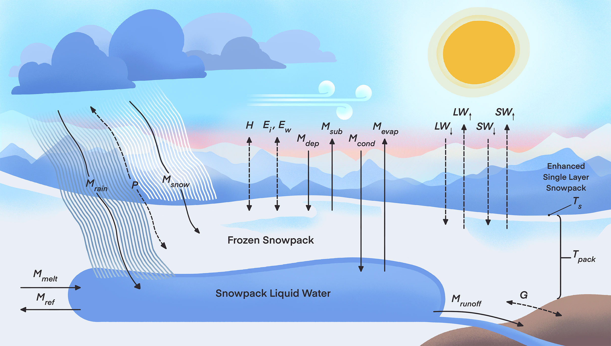

# Summary

`pySnowClim` is an open-source Python implementation of the process-based SnowClim
model for simulating snow dynamics including accumulation and melt processes.
The model achieves a balance between representing important physical processes, such as
energy balance calculations, snow density evolution, albedo dynamics,
and phase change processes, while simplifying other components to maintain
computationally efficiency, delivering consistent snowpack
simulations across diverse climatic conditions.
These characteristics make pySnowClim ideal for large-scale regional to continental
studies, studies requiring $< 1km$ spatial resolution such as those in complex terrain,
and studies evaluating the impact of alternate climate scenarios on snowpack.

# Statement of need

Snow is a critical component of the global water cycle.
The accurate simulation of snowpack dynamics is not only essential for
water resource management,
but also for flood forecasting, ecological studies, and climate change impact assessments
[@Caretta2022Water]. 

The target audience of `pySnowClim` includes hydrologists, climatologists,
ecologists, water resource managers,
and students who need reliable snow modeling capabilities for applications such as:

- **Research**: Detailed energy balance studies and process investigations
- **Operations**: Water resource forecasting and management
- **Education**: Teaching snow physics and energy balance concepts
- **Climate Studies**: Long-term snow evolution under changing conditions
- **Adaptation Planning**: Anticipating and planning adaptations to impacts of warming on snow-dependent species, ecosystems, and communities

In addition, the model can be used on different:

- **Spatial Scales**: Point locations to continental domains
- **Temporal Scales**: Sub-daily to daily timesteps, multi-decadal simulations
- **Environments**: Diverse snow climates from maritime to continental

# State of the field

Many current snow models are either computationally efficient but only represent
physical processes to a very limited extent (e.g. temperature index models),
or represent many important physical processes but are too computational
burdensome for large-scale high-resolution applications (e.g. most process-based models).
In addition, many are propriety, not easily accessible, or difficult to integrate
with modern scientific workflows
[@Ikeda2021; @Walter2005; @Liston2006SnowModel; @Garen2005EnergyBalanceSnowmelt; @Wrzesien2018MountainSnow].
`pySnowClim` addresses some of these problems by offering a flexible,
efficient, and open alternative with a good balance between representing physical processes and usability.

# Software design

The model architecture of `pySnowClim` package follows object-oriented design principles with clear
separation between forcing data handling, parameter management,
core physics calculations, and output generation.
`pySnowClim` leverages NumPy's vectorized operations for processing multiple grid points simultaneously, enhancing computational efficiency.
It also uses xarray and pandas for more efficient data manipulation and NetCDF I/O operations.
The package includes a comprehensive testing framework, featuring unit tests for individual physics functions and integration tests for complete workflows.
`pySnowClim` also provides extensive documentation
[(https://abbylute.github.io/pySnowClim)](https://abbylute.github.io/pySnowClim),
including API references, example datasets, and validation against observations from a snow monitoring site.
Model outputs include standard snow variables (SWE, depth, density, melt, albedo, temperature)
as well as detailed energy budget components.

# Research impact statement

There are several key improvements of `pySnowClim` compared to the original MATLAB-based SnowClim model [@lute2022].
A Python package makes the model more accessible to a wider scientific and practical audience.
Python is widely adopted in earth science and data science communities,
and a well-supported package enables easier integration, reproducibility,
and further development.
An example is the current implementation of coupling between
`pySnowClim` and the Community Water Model (CWatM) [@BurekCWatM2020]
[(https://github.com/iiasa/CWatM)](https://github.com/iiasa/CWatM).
In addition, to make the model more realistic, a new functionality was added to reduce excessive snow accumulation (i.e. snow towers) using an optional radiation enhancement.

# The model
`pySnowClim` employs the fundamental principles of mass and energy conservation as its core framework.
The model requires meteorological forcing data including temperature,
precipitation, shortwave radiation, longwave radiation, wind speed, humidity,
and pressure to simulate critical snow variables such as snow water equivalent (SWE),
snow depth, snow density, snow melt, snowpack liquid water content, albedo, and energy fluxes.
\autoref{fig:snowclim} shows the snow model conceptual diagram.

`pySnowClim` calculates the net energy flux to the snow surface accounting for
shortwave and longwave radiation, sensible and latent heat fluxes with
stability corrections, ground heat flux, and precipitation heat flux \autoref{eq:energy}.
The model is built around the surface energy balance equation:

\begin{equation}
\label{eq:energy}
   Q_{net} = SW_{down} - SW_{up} + LW_{down} - LW_{up} + H + E_{i} + E_{w} + G + P
\end{equation}

Where $SW$ denotes shortwave radiation fluxes, $LW$ denotes longwave radiation fluxes,
$H$ is the sensible heat flux, $E$ is the latent heat flux of ice ($i$) and water ($w$),
$G$ is the ground heat flux, and $P$ is the advected heat flux from precipitation.

The model tracks snow accumulation, sublimation and evaporation processes,
snowmelt generation, and liquid water movement through the snowpack with mass conservation \autoref{eq:masssolid}.
Mass balance of the solid $(M_{s})$ and liquid $(M_{l})$ portions of the snowpack are governed by:

\begin{equation}\label{eq:masssolid}
   M_{s} = M_{snow} + M_{ref} - M_{melt} + M_{dep} - M_{sub}
\end{equation}

\begin{equation}\label{eq:massliquid}
   M_{l} = M_{rain} - M_{ref} + M_{melt} - M_{runoff} + M_{cond} - M_{evap}
\end{equation}

Where $M_{snow}$ is the mass of new snowfall,
$M_{ref}$ is the mass of the snowpack liquid water that has been refrozen,
$M_{melt}$ is the mass of snow that has melted, $M_{dep}$ is the mass of deposition,
$M_{sub}$ is the mass of sublimation, $M_{rain}$ is the mass of rain added to the snowpack,
$M_{runoff}$ is the mass of liquid water that has left the snowpack as runoff,
$M_{cond}$ is the mass of condensation, and $M_{evap}$ is the mass of evaporation.

Other key model components include precipitation phase determination using bivariate logistic regression [@Jennings2018],
fresh snow density calculation based on temperature [@Anderson1976],
snow density evolution through compaction processes, liquid water retention and drainage.
`pySnowClim` has three different albedo scheme implementations
including aging effects,
melting conditions, and seasonal variations with options for different complexity levels
[@HammanVIC2018; @LiangVIC1994; @ESSERY2013; @Tarboton1996UEB].

# AI usage disclosure

In preparing this work, the authors used ChatGPT (OpenAI) and Claude (Anthropic) to assist with the 
initial MATLAB‑to‑Python translation and generation of code documentation.  The unit tests of the package were carried out by using Claude.
After using these tools, the authors thoroughly reviewed, edited and refined the content, and take full responsibility for the content of this publication.
No generative AI tools were used in the development of the writing of this manuscript.

# Acknowledgements

We would like to thank Dr. Alex Cannon and Dr. Narayan Shrestha
for their constructive comments and suggestions.
In addition, we thank Lincoln Lute for providing the conceptual diagram of the
snow model.

# References
