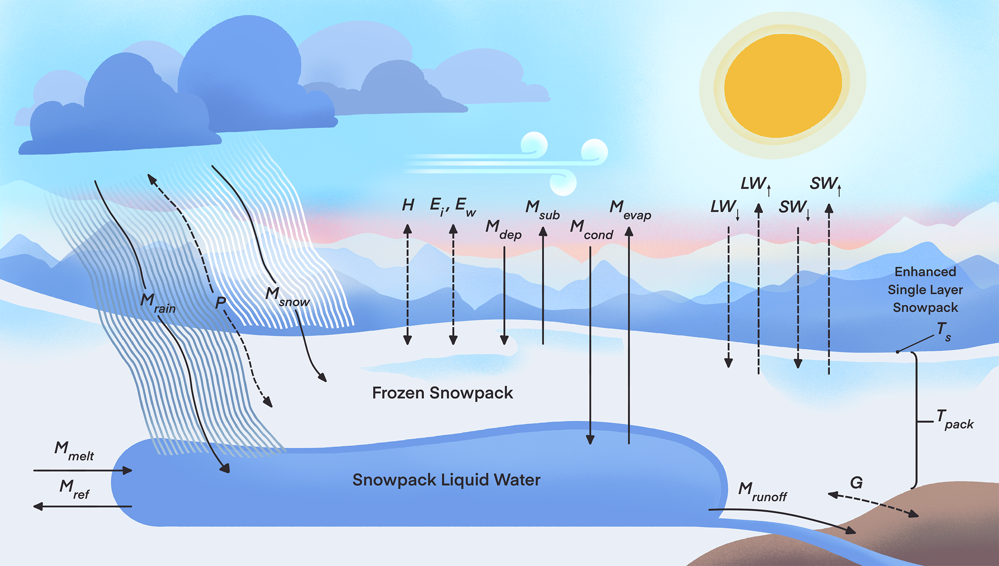

# Summary

`pySnowClim` is an open-source Python implementation of the process-based SnowClim
model for simulating snow dynamics including accumulation and melt processes.
The model achieves a balance between representing important physical processes, such as
energy balance calculations, snow density evolution, albedo dynamics,
and phase change processes, while simplifying other components to maintain
computationally efficiency, delivering consistent snowpack
simulations across diverse climatic conditions.
Building on these strengths of SnowClim, pySnowClim adopts a layered architecture with 
vectorized multi-point computation using standardized NetCDF I/O. 
This makes pySnowClim suitable for point to large scale applications, 
and ready to couple with climate and hydrological models.

# Statement of need

Snow is a critical component of the global water cycle.
The accurate simulation of snowpack dynamics is not only essential for
water resource management,
but also for flood prediction, ecological studies, and climate change impact assessments
[@Anderson2023plant; @Anderson2025geneflow; @Dixon2026rainonsnow; @Williams2026forestfire]. 

The target audience of `pySnowClim` includes hydrologists, climatologists,
ecologists, water resource managers,
and students who need reliable snow modeling capabilities for applications such as:

- **Research**: Detailed energy balance studies and process investigations
- **Operations**: Water resource forecasting and management
- **Education**: Teaching snow physics and energy balance concepts
- **Climate Studies**: Long-term snow evolution under changing conditions
- **Adaptation Planning**: Anticipating and planning adaptations to impacts of warming on snow-dependent species, ecosystems, and communities

In addition, the model can be used on different:

- **Spatial Scales**: Point locations to continental domains
- **Temporal Scales**: Sub-daily to daily timesteps, multi-decadal simulations
- **Environments**: Diverse snow climates from maritime to continental

# State of the field

Many current snow models are either computationally efficient but only represent
physical processes to a very limited extent (e.g. temperature index models),
or provide a detailed physical process representation but are too computational
burdensome for large-scale high-resolution applications (e.g. most process-based models) [@Ikeda2021; @Walter2005; @Liston2006SnowModel; @Garen2005EnergyBalanceSnowmelt; @Wrzesien2018MountainSnow].

SnowClim [@lute2022] was developed to offer a flexible,
efficient, and open source alternative with a good balance between representing physical processes and usability. 
However, the original MATLAB-based model has no separation of I/O and physics, relies on .mat files, and MATLAB usage is tied to licensing issues, 
which restricts wider applicability.
Thus, `pySnowClim` being based on Python programming environment, 
makes the model more accessible to a wider scientific and practical audience when compared to the original MATLAB-based model.

# Software design

In the original MATLAB SnowClim workflow, execution was driven by a wrapper script that prepared data (.mat files) and called the main routine. Parameters were loaded from a file, and the timestep loop computed physics while managing state and outputs. Thus, effectively orchestration and configuration were coupled with the core calculations.
In addition, the state of the snowpack used a  procedural approach which is more prone to state-update bugs.
Additonally, while style works well for a MATLAB-only workflow, it makes it harder to embed SnowClim as a “callable component” inside another model’s time loop without the separation of I/O/configuration from computation. 

pySnowClim adopts a layered architecture: a core physics engine (timestep calculations) is separated from a runner (I/O + orchestration) and a CLI for batch/operational use.
The new implementation also prioritizes vectorized multi-point computation and standardized NetCDF/NumPy I/O, with explicit JSON-based configuration.
Research workflows often need the same physics to run in different contexts: notebooks, batch jobs, or pipelines with standardized I/O. Separating the engine from I/O makes easier to validate physics independently of data inputs format.  
pySnowClim uses an encapsulated state with more abstraction than the procedural approach used in MATLAB, where the 
model state and outputs are explicit data structures (e.g., Snowpack state and preallocated SnowModelVariables). 

Overall, these changes support maintainability, reduce risk of subtle state-update bugs, and make easier the addition of new diagnostics, and variables.
The changes allow pySnowClim to be more easily coupled to hydrology/land-surface/ecosystem models as a drop-in component (shared arrays/NetCDF, pipeline execution) without changing core physics. 

# Research impact statement

When a model is already published/validated
[@Jans2025Sentinel; @Anderson2025geneflow; @Dixon2026rainonsnow; @Williams2026forestfire; @Boeykens2025MLsentinel], 
researchers need confidence that the new implementation is behaviorally comparable. Also, a well-supported Python package enables easier integration, reproducibility,
and further development. 
`pySnowClim` provides an extensive documentation
including API references, example datasets, and validation against observations from a snow monitoring site. It also includes a comprehensive testing framework, featuring unit tests for individual physics functions and integration tests for complete workflows. 
In addition, there is a current implementation of coupling between
`pySnowClim` and the Community Water Model (CWatM) [@BurekCWatM2020]
[(https://github.com/iiasa/CWatM)](https://github.com/iiasa/CWatM).

# The model
`pySnowClim` employs the fundamental principles of mass and energy conservation as its core framework.
The model requires meteorological forcing data including temperature,
precipitation, shortwave radiation, longwave radiation, wind speed, humidity,
and pressure to simulate critical snow variables such as snow water equivalent (SWE),
snow depth, snow density, snow melt, snowpack liquid water content, albedo, and energy fluxes.
\autoref{fig:snowclim} shows the snow model conceptual diagram.

`pySnowClim` calculates the net energy flux to the snow surface accounting for
shortwave and longwave radiation, sensible and latent heat fluxes with
stability corrections, ground heat flux, and precipitation heat flux \autoref{eq:energy}.
The model is built around the surface energy balance equation:

\begin{equation}
\label{eq:energy}
   Q_{net} = SW_{down} - SW_{up} + LW_{down} - LW_{up} + H + E_{i} + E_{w} + G + P
\end{equation}

Where $SW$ denotes shortwave radiation fluxes, $LW$ denotes longwave radiation fluxes,
$H$ is the sensible heat flux, $E$ is the latent heat flux of ice ($i$) and water ($w$),
$G$ is the ground heat flux, and $P$ is the advected heat flux from precipitation.

The model tracks snow accumulation, sublimation and evaporation processes,
snowmelt generation, and liquid water movement through the snowpack with mass conservation \autoref{eq:masssolid}.
Mass balance of the solid $(M_{s})$ and liquid $(M_{l})$ portions of the snowpack are governed by:

\begin{equation}\label{eq:masssolid}
   M_{s} = M_{snow} + M_{ref} - M_{melt} + M_{dep} - M_{sub}
\end{equation}

\begin{equation}\label{eq:massliquid}
   M_{l} = M_{rain} - M_{ref} + M_{melt} - M_{runoff} + M_{cond} - M_{evap}
\end{equation}

Where $M_{snow}$ is the mass of new snowfall,
$M_{ref}$ is the mass of the snowpack liquid water that has been refrozen,
$M_{melt}$ is the mass of snow that has melted, $M_{dep}$ is the mass of deposition,
$M_{sub}$ is the mass of sublimation, $M_{rain}$ is the mass of rain added to the snowpack,
$M_{runoff}$ is the mass of liquid water that has left the snowpack as runoff,
$M_{cond}$ is the mass of condensation, and $M_{evap}$ is the mass of evaporation.

Other key model components include precipitation phase determination using bivariate logistic regression [@Jennings2018],
fresh snow density calculation based on temperature [@Anderson1976],
snow density evolution through compaction processes, liquid water retention and drainage.
`pySnowClim` has three different albedo scheme implementations
including aging effects,
melting conditions, and seasonal variations with options for different complexity levels
[@HammanVIC2018; @LiangVIC1994; @ESSERY2013; @Tarboton1996UEB].
In addition, similarly to other models [@BurekCWatM2020; @anderson2006snow], a new functionality was added to reduce excessive snow accumulation (i.e. snow towers) using an optional radiation enhancement.

# AI usage disclosure

In preparing this work, the authors used ChatGPT (OpenAI) and Claude (Anthropic) to assist with the 
initial MATLAB‑to‑Python translation and generation of code documentation.  The unit tests of the package were carried out by using Claude.
After using these tools, the authors thoroughly reviewed, edited and refined the content, and take full responsibility for the content of this publication.
No generative AI tools were used in the development of the writing of this manuscript.

# Acknowledgements

We would like to thank Dr. Alex Cannon and Dr. Narayan Shrestha
for their constructive comments and suggestions.
In addition, we thank Lincoln Lute for providing the conceptual diagram of the
snow model.

# References
